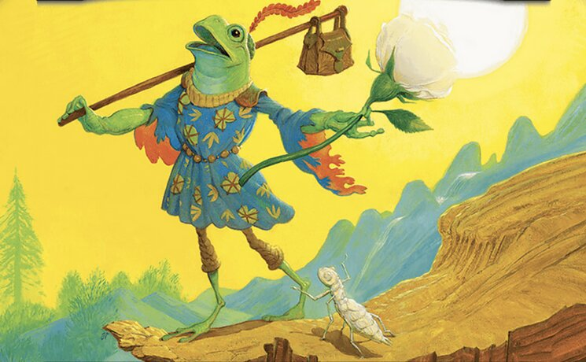
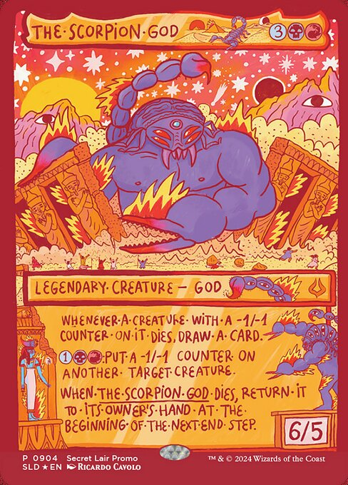
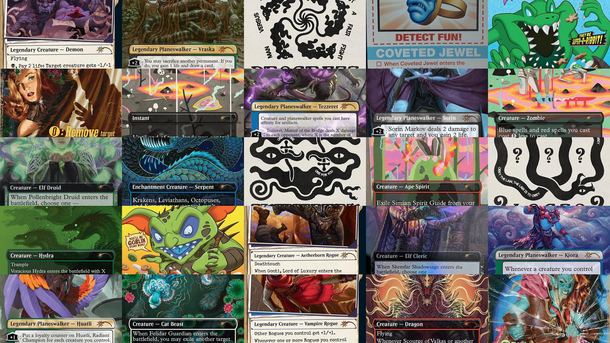
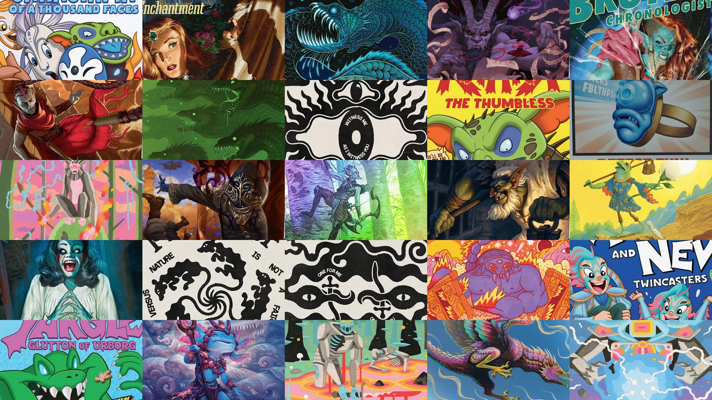

# Creation

`art_image_dl.py` Output Example



`image_dl.py` Output Example



`create_wallpaper.py` Input/Output examples. These are randomized.

```
Enter the directory containing JPG files: downloaded_images
Choose a screen size:
1: 1920x1080 (Full HD)
2: 2560x1440 (2K)
3: 3840x2160 (4K)
4: 1280x720 (HD)
5: 1600x900 (HD+)
Enter the number corresponding to your choice: 1
Enter the name of the output wallpaper file (e.g., wallpaper.jpg): wallpaper.jpg
Wallpaper saved as wallpaper.jpg
```
Full card output (will work to fix this)


Artcrop output
